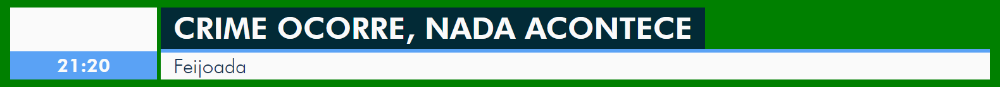

# PraçaTV Clone (vanilla)

Um clone do gerador de caracteres (GC) utilizado nos telejornais regionais

Em Breve™: Uma implementação em VueJS

## Demonstração

https://lucaspontoexe.github.io/pracatv-vanilla/

## Uso

1. Altere o texto nas caixas

    

2. Os botões controlam as animações de entrada e saída

    

3. Os outros botões alteram o esquema de cores

    

## Licença

~~deixa eu passar~~ Ainda tem que resolver isso, qualquer coisa, abra uma issue